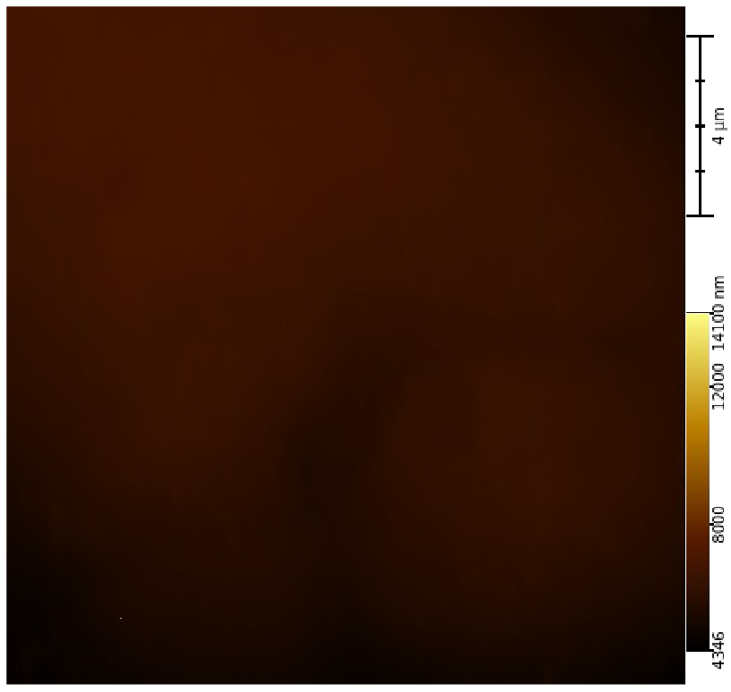
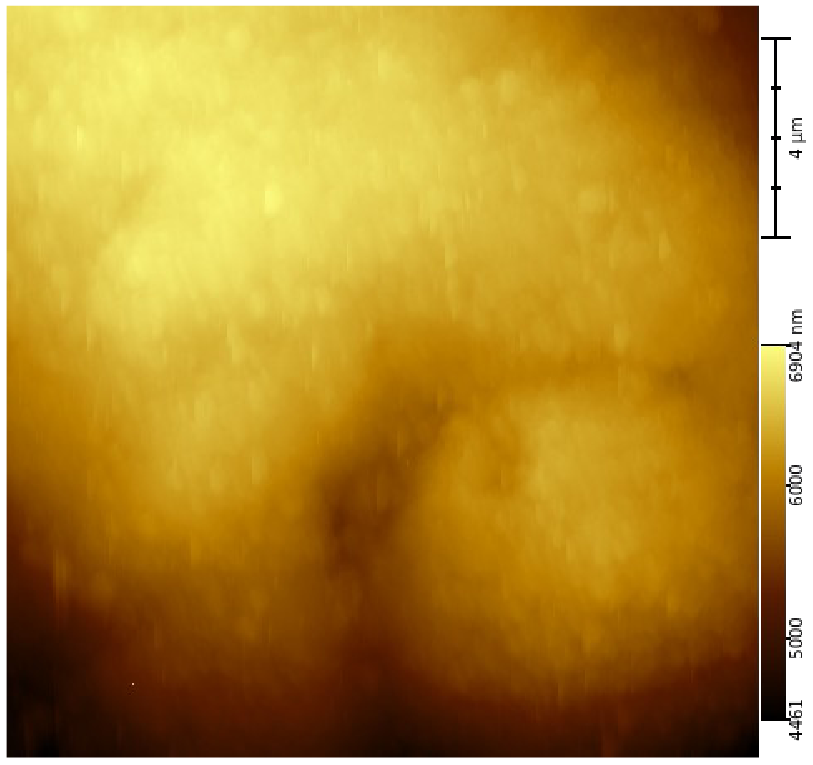
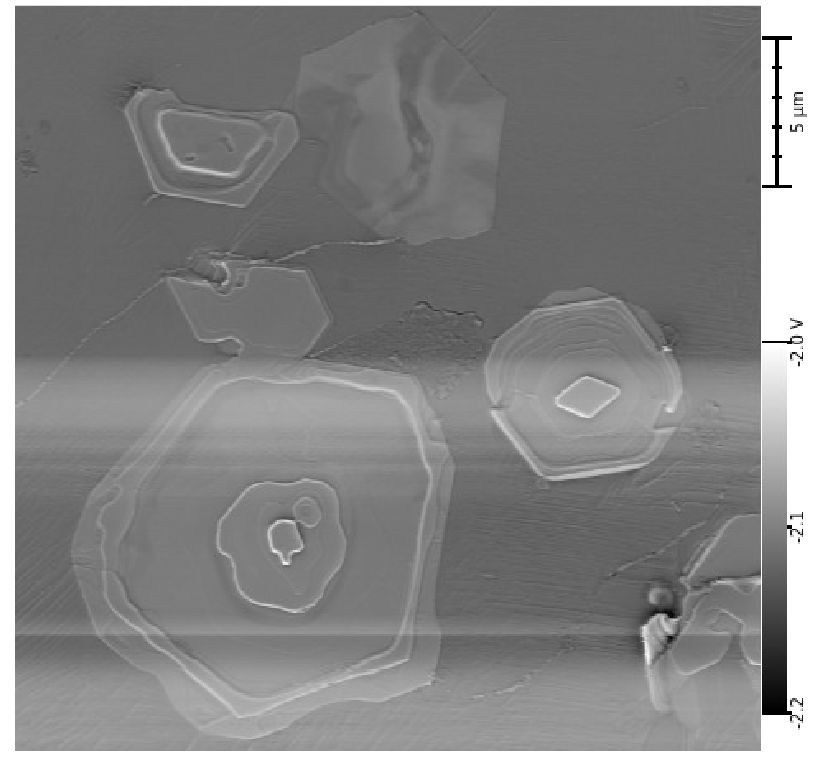
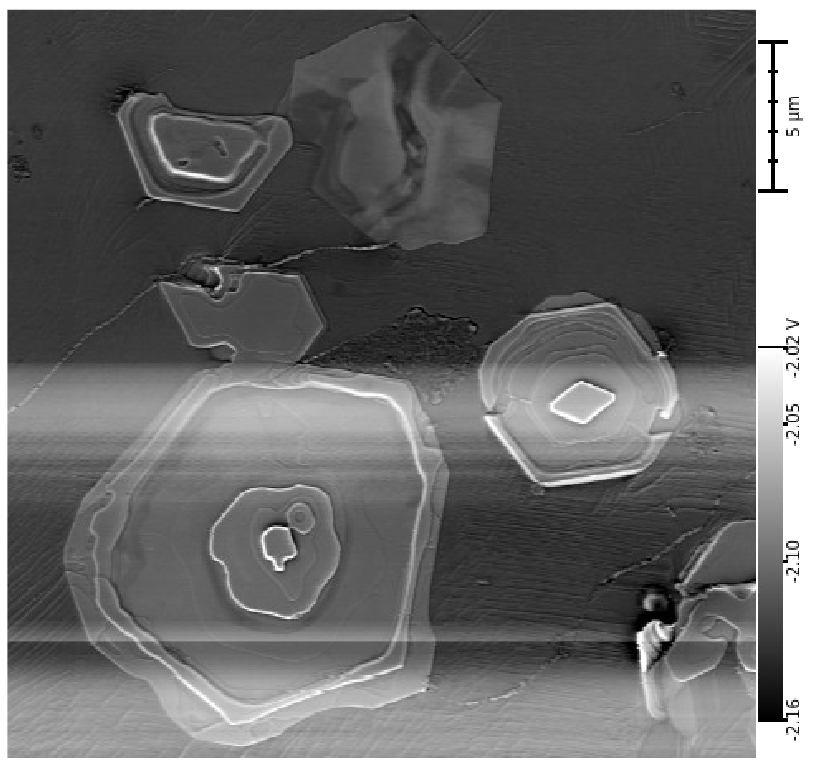

# AFM Auto Contrast – JavaScript Library for Contrast Optimization

## Automatická optimalizace kontrastu AFM/SEM snímků

Tento repozitář obsahuje implementaci funkce pro automatickou optimalizaci kontrastu v jazyce JavaScript, navrženou pro zvýšení srozumitelnosti obrazových dat z měření pomocí mikroskopie atomárních sil (AFM) a skenovací elektronové mikroskopie (SEM). Funkce využívá analýzu histogramu jasových hodnot k výběru optimálního rozsahu intenzit a potlačení extrémních artefaktů.

Tato knihovna vznikla v rámci projektu **[TACOM – TM03000033](https://starfos.tacr.cz/cs/projekty/TM03000033)** a je součástí softwaru **NenoView**.

---

## 📂 Struktura repozitáře

- `src/autoContrast.js` – hlavní implementace funkce `calculateContrastScale(data, min, max)`
- `src/histogram.js` – pomocná funkce `calculateHistogram()`
- `examples/AFM_before_after.png` – referenční AFM snímek bez a s kontrastem
- `examples/SEM_before_after.png` – referenční SEM snímek bez a s kontrastem
- `README.md` – tento dokument

---

## ✨ Funkce a použití

### Import

```js
import { calculateContrastScale } from './src/autoContrast.js';
```

### Použití

```js
const data = [/* pole hodnot z AFM nebo SEM snímku */];
const [min, max] = calculateContrastScale(data);
```

Můžete volitelně zadat vlastní rozsah:

```js
const [min, max] = calculateContrastScale(data, 10, 250);
```

Funkce vrátí optimální hodnoty kontrastu, které je možné použít k lineárnímu mapování intenzit např. v canvasu, WebGL nebo jiném zobrazovacím nástroji.

---

## 📊 Validace

Validace byla provedena na reálných AFM a SEM snímcích. Výsledky byly hodnoceny vizuálně odborníky v oblasti mikroskopie. Automatická optimalizace kontrastu zvýšila čitelnost a potlačila šum bez ztráty klíčových detailů.

Ukázka výsledků:

### AFM

| Před | Po |
|------|----|
|  |  |

### SEM

| Před | Po |
|------|----|
|  |  |

---

## 🛠️ Technické detaily

- Histogram má 512 binů
- Detekce je založena na 5% per-bin prahu a 2% kumulativním histogramu
- Není třeba žádná externí knihovna ani framework
- Funkce je čistě funkcionální a snadno integrovatelná

---

## AFM/SEM Image Contrast Optimization – JavaScript Library

This repository contains a JavaScript implementation of a function for automatic contrast optimization, designed to enhance the interpretability of image data acquired via Atomic Force Microscopy (AFM) and Scanning Electron Microscopy (SEM). The function analyzes histogram distributions of intensity values to select the optimal range and suppress outliers.

This library was developed as part of the **[TACOM – TM03000033](https://starfos.tacr.cz/cs/projekty/TM03000033)** project and is integrated in the **NenoView** software package.

---

## 📂 Repository Structure

- `src/autoContrast.js` – main implementation of `calculateContrastScale(data, min, max)`
- `src/histogram.js` – helper function `calculateHistogram()`
- `examples/AFM_before_after.png` – reference AFM image before and after contrast adjustment
- `examples/SEM_before_after.png` – reference SEM image before and after contrast adjustment
- `README.md` – this documentation

---

## ✨ Functionality & Usage

### Import

```js
import { calculateContrastScale } from './src/autoContrast.js';
```

### Usage

```js
const data = [/* array of AFM or SEM pixel values */];
const [min, max] = calculateContrastScale(data);
```

Optionally provide your own range:

```js
const [min, max] = calculateContrastScale(data, 10, 250);
```

The function returns optimal contrast range values that can be used for linear intensity mapping, e.g., in canvas rendering, WebGL, or other image visualization tools.

---

## 📊 Validation

Validation was performed on real AFM and SEM images. The results were visually assessed by microscopy experts. The contrast optimization enhanced clarity and suppressed noise without losing key details.

Example results:

### AFM

| Before | After |
|--------|-------|
|  |  |

### SEM

| Before | After |
|--------|-------|
|  |  |

---

## 🛠️ Technical Details

- Histogram with 512 bins
- Detection based on 5% per-bin and 2% cumulative thresholds
- No external dependencies or frameworks required
- Fully functional, modular implementation

---

## 📄 License

This project is open-source and freely available as part of the public dissemination activities of the TACOM project.
